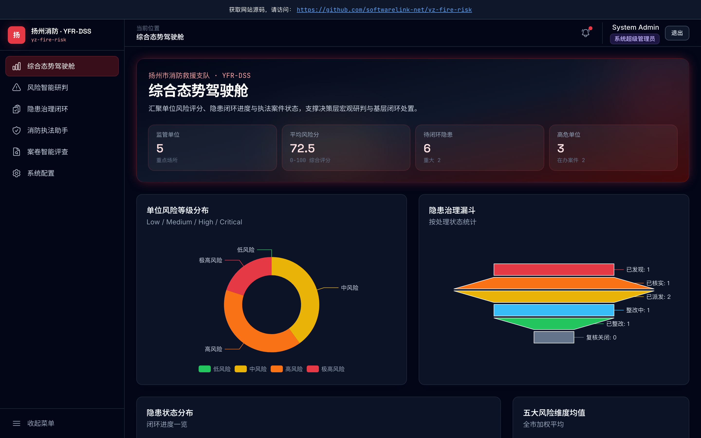

# 扬州市火灾风险研判和隐患治理决策辅助系统

- **上线主域名**：https://yz-fire-risk.softwarelink.net/
- **项目仓库**：https://github.com/softwarelink-net/yz-fire-risk



## 🚀 部署与运行说明

### 环境要求
- Node.js >= 18.0.0
- npm >= 9.0.0

### 依赖安装
```bash
npm install
```

### 本地运行
```bash
npm run dev
```
访问 `http://localhost:5173` 查看效果。

### 演示账号密码表
| 角色 | 用户名 | 密码 | 说明 |
| :--- | :--- | :--- | :--- |
| 超管 | `admin` | `admin123` | 拥有所有系统配置权限 |
| 消防主管 | `mgr_zhang` | `mgr123` | 负责隐患派发、审批与案卷评查 |
| 消防监督员 | `agent_li` | `agent123` | 负责一线隐患治理与执法辅助 |
| 决策领导 | `chief_wang` | `chief123` | 专注风险态势与宏观决策 |

### 常用 npm 脚本
- `npm run dev`: 启动本地开发服务器（Vite）
- `npm run build`: 生产环境构建（输出至 `dist/`）
- `npm run preview`: 本地预览生产构建包
- `npm run lint`: 代码静态检查与格式化

### 目录结构树
```text
yz-fire-risk/
├── docs/                     # 项目文档与资产
│   └── assets/               # 图片、预览图
├── public/                   # 静态公共资源
├── src/
│   ├── assets/               # 样式、字体、图标
│   ├── components/           # 可复用原子组件 (Banner, UI)
│   ├── layouts/              # 页面布局 (AuthLayout, MainLayout, PublicLayout)
│   ├── router/               # Vue Router 路由定义与守卫
│   ├── stores/               # Pinia 状态管理 (User, Db)
│   ├── utils/                # 工具函数 (sql.js 封装, 类型定义)
│   ├── pages/                # 页面视图 (Dashboard, Risk, Hazard, Enforcement)
│   ├── App.vue
│   └── main.ts
├── allworld-sites/           # [Reserved] Worker 托管路径标识
├── index.html                # 入口 HTML (含 SEO Head)
├── package.json
├── tailwind.config.js
├── tsconfig.json
└── vite.config.ts
```

## 📜 招标公告全文

**1. 标题**：扬州市消防救援支队2026年度火灾风险研判和隐患治理决策辅助系统项目采购公告
**2. 项目发包方**：扬州市消防救援支队本级
**3. 项目编号**：JSZC-321000-JZCG-G2026-0093
**4. 项目发布时间**：2026-09-01
**5. 关键词**：消防, 风险研判, 隐患治理, 决策辅助, 政府采购, 扬州
**6. 摘要**：扬州市消防救援支队计划采购一套火灾风险研判和隐患治理决策辅助系统，预算金额 140.9 万元。项目包含风险智能研判预警、隐患治理协同闭环、消防执法助手、综合态势展示与决策分析、行政处罚案卷智能评查五个子模块。
**7. 技术要点**：采用微服务架构，容器化部署于扬州市政务云；需满足等保三级和商用密码应用安全性评估要求；需与现有驯火系统、防消联勤信息系统、消防设施联网监测平台、119接处警系统完成数据对接。
**8. 技术创新性**：构建五大维度动态指标体系与风险模型库；实现防消联勤数据双向贯通；利用 AI 进行执法文书自动生成与案卷自动评查。

## ⚖️ 免责声明

1. **数据来源与合规性**：本项目所涉数据信息均采集自互联网公开渠道发布的标讯公示信息。项目开发者严格遵守《中华人民共和国数据安全法》及相关法律法规，确保数据来源合法、公开、可查询。
2. **技术实现路径**：本项目核心内容系基于国产大语言模型进行算法推演与自动化构造生成，非直接引用或复制原始招标文件。
3. **保密承诺**：本项目郑重承诺：不涉及、不包含任何国家秘密、商业秘密或未公开的敏感信息。所有生成内容均基于公开数据的逻辑推演。
4. **知识产权与巧合声明**：鉴于本项目内容均由AI模型基于公开数据推演生成，若生成内容在表述方式、结构逻辑上与任何第三方原始标书文件存在相似之处，纯属技术通用设计之巧合，不构成对任何第三方著作权的侵犯或商业秘密的泄露。本项目不保证生成内容的准确性与完整性，仅供技术研究与学习参考。
5. **免责条款**：任何单位或个人使用本项目代码及生成内容所产生的一切后果，均由使用者自行承担，项目开发者不承担任何法律责任。
